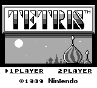
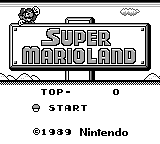
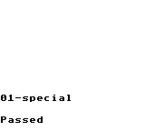
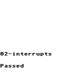
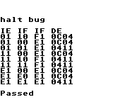
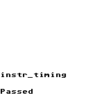
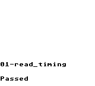
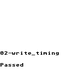

# go-jeebie

[](https://github.com/valerio/go-jeebie/actions)

A Game Boy emulator written in Go.

## Requirements

- Go 1.23 or later

## Building and Running

```bash
# Build the emulator
make build

# Run a Game Boy ROM with SDL2 (must have SDL2 installed)
make run-sdl2 path/to/rom.gb

# Run tests
make test

# Run all tests, including snapshot tests for Blargg's test suite
make test-all
```


## Status

Still a work in progress. Can currently run some simple games, and passes basic test roms for rendering/CPU behavior, see the [Test ROMs](#test-roms) section below.

### Games

Simple games running in the emulator:

 

### Test ROMs

ROMs are collected from the excellent [c-sp’s gameboy-test-roms collection](https://github.com/c-sp/gameboy-test-roms).
Huge thanks to the original authors (Blargg, Matt Currie and more) and maintainers of these suites.

These test ROMs are run as part of 
```bash
make test-integration
```

A snapshot of the screen is taken at the end of each test, and compared to a reference snapshot stored in `test/integration/testdata/snapshots`.

<details>
<summary>Passing Tests (with generated snapshots)</summary>

<!-- SNAPSHOTS:START -->
<table>
  <tr>
    <td align="center"><br><sub>01-special ✅</sub></td>
    <td align="center"><br><sub>02-interrupts ✅</sub></td>
    <td align="center"><br><sub>03-op sp,hl ✅</sub></td>
    <td align="center"><br><sub>04-op r,imm ✅</sub></td>
  </tr>
  <tr>
    <td align="center"><br><sub>05-op rp ✅</sub></td>
    <td align="center"><br><sub>06-ld r,r ✅</sub></td>
    <td align="center"><br><sub>07-jr,jp,call,ret,rst ✅</sub></td>
    <td align="center"><br><sub>08-misc instrs ✅</sub></td>
  </tr>
  <tr>
    <td align="center"><br><sub>09-op r,r ✅</sub></td>
    <td align="center"><br><sub>10-bit ops ✅</sub></td>
    <td align="center"><br><sub>11-op a,(hl) ✅</sub></td>
    <td align="center"><br><sub>dmg-acid2 ✅</sub></td>
  </tr>
  <tr>
    <td align="center"><br><sub>halt_bug ✅</sub></td>
    <td align="center"><br><sub>instr_timing ✅</sub></td>
    <td align="center"><br><sub>mem_timing_01-read ✅</sub></td>
    <td align="center"><br><sub>mem_timing_02-write ✅</sub></td>
  </tr>
</table>

<!-- SNAPSHOTS:END -->

</details>


## License

See the [license](./LICENSE.md) file for license rights and limitations (MIT).
