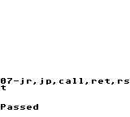

# go-jeebie

[](https://github.com/valerio/go-jeebie/actions)

A Game Boy emulator written in Go.

## Requirements

- Go 1.23 or later

## Building and Running

```bash
# Build the emulator
make build

# Run with a Game Boy ROM
./bin/jeebie path/to/rom.gb

# Run tests
make test

# Run all tests, including snapshot tests for Blargg's test suite
make test-all
```


## Status

Still a work in progress. Currently passes all of Blargg's CPU instruction tests and Matt Currie's [dmg-acid2](https://github.com/mattcurrie/dmg-acid2) PPU test.

### Graphics Tests & Game Screenshots

dmg-acid2 test:


Simple games running in the emulator:

 

### CPU Tests (Blargg's test suite - 11/11 passing)

  

  

  

 .png)


## License

See the [license](./LICENSE.md) file for license rights and limitations (MIT).